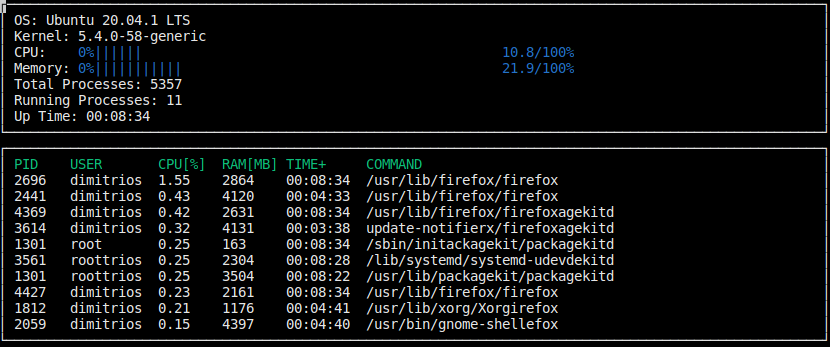

# Report

The solution is provided in the code files. 

In the Linux Parser, the appropriate functions were completed by reading specific files extract the relevant information. 

The most challenging task was the completion of the Process class and consequently the part of the System task that deals with the processes. 

In the System class, at each update the active processes are added to a vector and then sorted, in this case by CPU utilisation. Before adding the processes, the vector is cleared. This poses a limitation as is is not straightforward to have history and calculate the utilization at each step. In the implementation the CPU utilization of each process is taken from the power up. 

On the contrary for the CPU class itself, the deltas of the jiffies are extracted at each update step and the total CPU utilization is accurate. 

A screenshot from the running program is shown below:

A issues seems to be that when there is an update and the new value is shorter in characters, the characters from previous updates are not cleared. 

